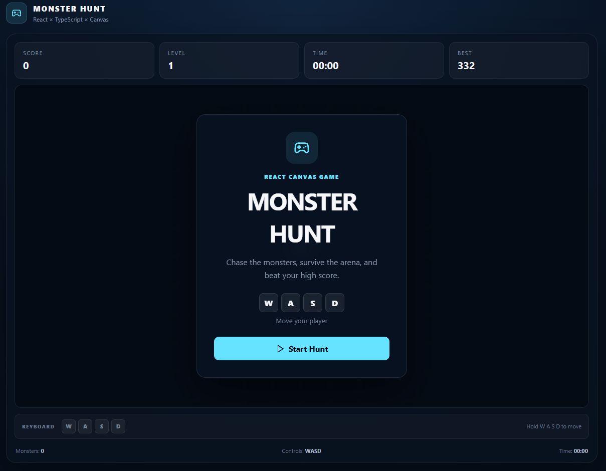
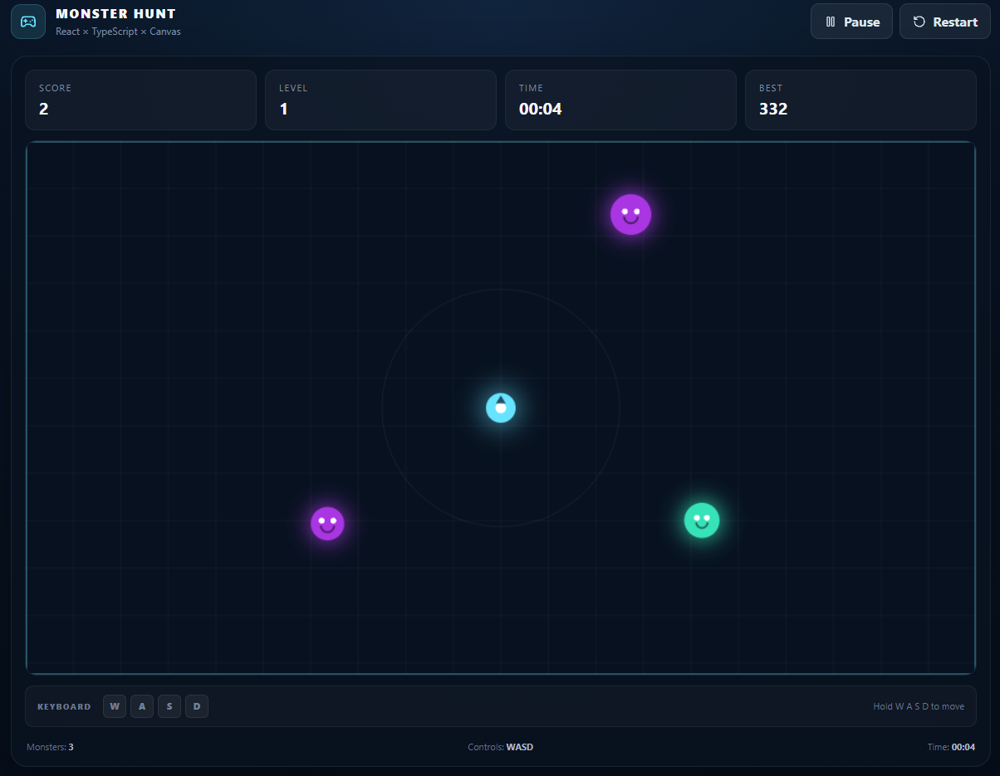

## Monster Hunt

A polished 2D browser game built with React + TypeScript + HTML5 Canvas + Vite.

The project starts from the classic canvas-game fundamentals—keyboard input, a frame-independent game loop, rendering and collision detection—and turns them into a portfolio-ready React application with reusable components, custom game logic, responsive UI, pause/game-over states, progressive difficulty, local high scores and automated tests.

## Screenshot




## Features

- React + TypeScript architecture
- WASD and arrow-key movement
- Frame-independent `requestAnimationFrame` game loop
- Procedurally positioned monsters with movement variation
- Collision detection with short post-capture invulnerability
- Progressive difficulty and levels
- Persistent best score via `localStorage`
- Pause/resume and game-over screens
- Responsive layout for desktop and smaller screens
- Unit tests with Vitest
- Separated game engine utilities, hooks, UI components and types
- Vite production build

## Tech Stack

React · TypeScript · HTML5 Canvas · Vite · Vitest · Lucide React

Run locally

Requirements: Node.js 18+.

```bash
npm install
npm run dev
```

Open the local URL printed by Vite.

Production build:

```bash
npm run build
npm run preview
```

Tests:

```bash
npm test
```

## Project structure

```text
monster-hunt-react/
├── public/
├── src/
│   ├── components/
│   │   ├── HUD.tsx
│   │   └── Overlay.tsx
│   ├── App.tsx
│   ├── game.ts
│   ├── game.test.ts
│   ├── main.tsx
│   ├── styles.css
│   ├── types.ts
│   └── useGame.ts
├── index.html
├── package.json
└── README.md
```

## Architecture

The rendering engine is intentionally kept inside a custom React hook:

- `useGame.ts` owns the animation lifecycle, keyboard state, mutable game entities and score updates.
- `game.ts` contains pure game calculations such as clamping, distance, collision detection, player movement, monster movement and spawning.
- `HUD.tsx` and `Overlay.tsx` are presentational React components.
- `App.tsx` composes the game UI and canvas.
- `types.ts` defines the shared domain model.

This project demonstrates:

1. **React architecture** — custom hooks and component composition.
2. **TypeScript** — explicit domain models and typed game APIs.
3. **Browser APIs** — Canvas, keyboard events, animation frames and local storage.
4. **Performance awareness** — mutable refs are used for per-frame state instead of forcing a React render on every animation frame.
5. **Game programming fundamentals** — delta-time movement, collision detection, procedural spawning and difficulty scaling.
6. **Testing** — deterministic game utilities are covered with unit tests.

## License

MIT. See `LICENSE`.
